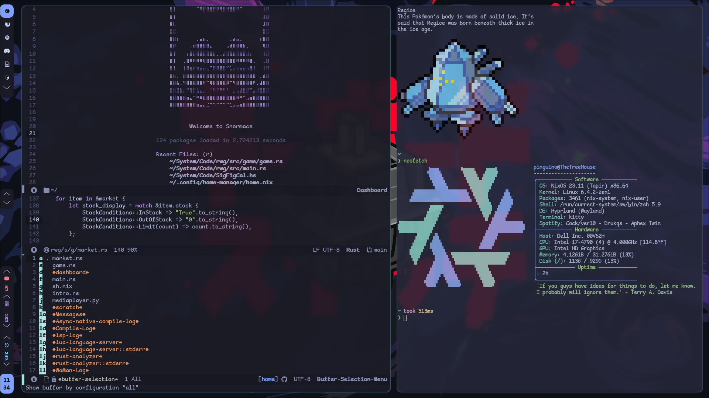

# TLP Dotfiles 2023

| System      | Description |
| :---        |    :----:   |
| Distro      | [Arch GNU/Linux + Nix](https://archlinux.org/)    |
| Secondary Distro   | [NixOS](https://nixos.org)   | 

| Software      | Description |
| :---          |    :----:   |
| WM               | [DWM](https://dwm.suckless.org/)                         |
| Secondary WM     | [River (Wayland)](https://github.com/riverwm/river)  |
| Editor           | [Sleepy-Nvim](https://github.com/thelinuxpirate/sleepy-nvim)    |
| Terminal         | [Kitty](https://sw.kovidgoyal.net/kitty/)                 |

## TODO
- Finish River config
- Reupdate & organize my dots
- Possibly revist NixOS?

## NixOS Machines

### TheTreeHouse

TheTreeHouse is my personal Desktop computer which runs off of NixOS.
It contains Hyprland as its main desktop; and XMonad in case of any reason in which I'd need a backup Desktop.

(TheTreeHouse has now been migrated to OpenSUSE Tumbleweed due to issues on NixOS)

### ThePirateShip
ThePirateShip is my personal laptop.
Its specs aren't great but its a fine laptop.
ThePirateShip uses the Snormacs desktop configuration as its main desktop.

## Home-Manager
I only have one user and that user is "pingu".
As of right now I do not need multiple Home-Manager configurations/declarations.
My Home-Manager is purely the software I want installed on my system that shouldn't be installed with the system. (AKA bloat)

## NixOS Struggle
I've struggled trying to use NixOS for about 7 months. 
Now I have the configuration down to contain my configurations at a reproducible level.

Would I recommend NixOS to other people? Probably not to be completely honest.
There is a lot of debugging of errors and the documentation for Nix sucks ass.
If you have no knowledge of programming you are guaranteed to struggle.

I still wonder if this is the distro for me; sometimes I just would like to go back to Gentoo.
Even if I went back to Gentoo I could still have some things be managed by Nix's Home-Manager.
My main issue is that Nix & NixOS have a heavy dependency with SystemD. So if you don't use SystemD
or plan to leave it, don't get too excited about managing your system with Nix...
